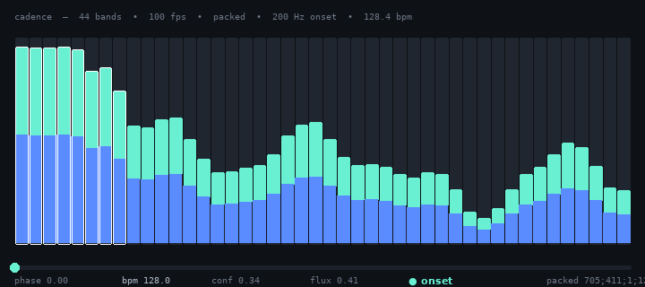

# cadence

[](https://github.com/lars/cadence/actions/workflows/ci.yml) [](LICENSE)

One pipewire capture, one fft, many consumers. Built for velarium, my own
shell, but it has no idea what reads it.



*44 bands at 100fps, bass onset in white, bpm/phase/conf from six seconds of autocorrelation - simulated output.*

```
cadence --format packed                          # scalars and bands, cheap to parse
cadence --format jsonl                           # the same, readable
cadence --format cava --bands 44                 # drop-in for a cava pipe
cadence --format amp                             # just the scalar
```

As the pipewire client rather than a client of one, the buffer and the window
are ours: a 256 frame quantum and a 2048 point window on a 480 sample hop, so
a frame lands every 10ms with 42.7ms of lookback. 0.55-0.65% of a core for 44
bands.

## Output

`--format cava` is cava's raw ascii, one integer per band, semicolon
separated. `--format amp` is one float per line.

`--format packed` is `;`-separated integers,
`amp;strength;onset;bpm;phase;conf;b0;...;bN` - everything thousandths except
onset (0 or 1) and bpm (tenths):

```
705;411;0;1372;143;245;821;524;271;354
```

`JSON.parse` per frame is too expensive at 60fps in some consumers, and the
scalars can be read off the front of the line without touching the bands.

`--format jsonl`:

```json
{"amp":0.34,"strength":0.15,"onset":false,"bpm":128.4,"phase":0.21,
 "conf":0.31,"bands":[0.10,0.29,0.84,...]}
```

- `amp` is the whole mix, 0..1, weighted towards the bottom third. A flat
  mean over 44 bands is mostly hiss and barely moves on a kick
- `onset` is a bass transient
- `strength` is the continuous half of it: how hard that transient was, 0..1
  against a slow running peak. The boolean fires the same for a tap and a
  drop, and this is what says which it was

`strength` used to be full-spectrum flux, which is a correct measurement of
something nothing wanted to watch - every hi-hat moved it, so it sat above
0.05 on about 80% of frames. Measured over two tracks, the bass strength sits
under that on 66-83% of frames and averages about 4x higher on an onset frame
than overall, while still reaching full scale.

## Onsets and tempo

Onsets come from the bins below `--onset-hz` (200 by default). The full
spectrum fires on every hi-hat, which is correct onset detection and useless
for driving something that should look like it follows the music. What comes
out is every bass transient, not every beat - on a busy bassline that is 3 or
more a second. `--onset-hz`, `--onset-threshold` and `--onset-refractory` tune
it.

`--odf` picks what those bins are measured by. `flux`, the default, is
positive magnitude change. `complex` predicts each bin from the last two
frames - magnitude holds, phase keeps advancing at the rate it was - and
measures how far the bin that turned up is from that guess. A note starting
under one already ringing moves phase without moving magnitude, and flux
cannot see it. It is rectified, so a note ending does not read as one
starting.

`complex` is not the default, and the reason is worth writing down. Onsets are
taken from below `--onset-hz`, and everything down there is a kick, and a kick
is a magnitude event. On click tracks at 100, 128 and 140 the two agree on
every onset to the millisecond. On real tracks they find the same median tempo
and trade which one jumps an octave more often. Where the difference should
have been decisive - a tone re-articulated at a constant level, phase
restarting and magnitude never moving - `complex` caught 28 of 40 and `flux`
double-fired to 80, so neither reads that cleanly either.

It is here because it is the right tool once onsets stop being kicks. It costs
about nine `atan2` a frame, since only the onset bins are ever measured this
way.

`bpm`, `phase` and `conf` come from autocorrelation over six seconds of onset
strength, with a phase accumulator nudged by onsets. A period and a phase let
a consumer know where the next beat lands before it arrives, so it can move
continuously instead of jerking in response. Locks on in about seven seconds,
costs 0.15% of a core.

Confidence is a correlation coefficient, normalised by the variance, so a
spike train scores near 1 against itself a period later and white noise sits
near `1/sqrt(pairs)`. Autocorrelation cannot tell a beat from every other
beat, so whichever candidate lands nearest 120bpm wins.

## One application

`--app spotify` captures that application instead of the sink, matched loosely
on its name. It is silent while nothing matches and attaches by itself when
the application starts.

`PW_KEY_TARGET_OBJECT` pointed at an application's node is silently ignored -
the session manager links capture streams to sources, and an application is a
`Stream/Output/Audio`. The links get made by hand through the link factory
instead: watch the registry for a matching node, find its output ports, link
each into our own input port. Several outputs into one input is how pipewire
mixes, so a stereo application arrives already summed. Autoconnect has to be
off in this mode, or the stream sits there analysing the microphone while it
waits.

An idle application produces no frames at all, so a consumer watching the
numbers needs its own timeout.

## Scaling

Bands are dB by default over a 45dB floor. `--scale linear` is the raw
magnitude, where bass carries almost all the energy and two thirds of the
graph sits in the single digits:

```
 75 100  91  93  55  10   8  14  43  18  11  11   6  11   7   4   3   4
 95 100  96  89  72  67  64  52  45  45  46  57  46  43  34  36  34  33
```

`--floor` moves the point that reads as zero. Lower is punchier at the top and
saturates the bass, higher lifts the whole graph and flattens it.

## Running it on a file

`--file track.wav` analyses a wav instead of capturing one, as fast as it can,
and exits at the end. Same analyzer, same output, no pipewire in the process
at all.

```sh
cadence --file track.wav --format packed | awk -F';' '{print $4/10}'
```

A capture cannot be run twice and cannot be argued with. A file can, which is
what makes `--onset-threshold` and `--odf` answerable rather than a matter of
watching a bar and forming an opinion. The `--odf` note above is what came out
of doing that.

16, 24 and 32 bit pcm and 32 bit float, mono or more, and the file's own rate
wins over `--rate`. Channels are averaged, which is what the live path sees -
`capture.c` asks pipewire for one channel and lets audioconvert do the mixing.

## Resynthesis

The binary only ever reads. The library underneath it also puts samples back,
which the analysis path has no use for and which is most of what is
interesting about phase.

`src/stft.zig` is the two halves of a short-time transform kept apart:
`Analysis` hands out complex spectra, `Synthesis` takes them back and
overlap-adds. Nothing is assumed in between, so a caller can rewrite a
spectrum or hand frames back at a different rate than they arrived.
`Synthesis` divides by the window that actually accumulated rather than by a
constant, so any hop reconstructs, not only one that divides the window.

`src/vocoder.zig` is a phase vocoder on top of it. `Stretch` changes length
at the same pitch, `Shift` changes pitch at the same length by stretching and
resampling by the same factor. Magnitude carries between frames unchanged.
Phase cannot: what an analysis phase difference actually says is a frequency,
and a frequency is the part that survives a change of hop.

Two things separate it from the textbook version. Bins belonging to one
partial are held to the phase of their peak, or they drift apart and a note
turns into a smear. And phase snaps back to the input when the spectrum
jumps, since a drum hit is the one thing a vocoder cannot interpolate through.

Nothing here is wired to the CLI yet.

## Layout

- `src/fft.zig`, `src/stft.zig`, `src/analysis.zig`, `src/tempo.zig`,
  `src/vocoder.zig` and `src/output.zig` are the dsp half. No system
  dependencies, so `zig build test` runs without pipewire installed
- `src/capture.c` is the pipewire client. It is C on purpose: zig's
  translate-c cannot parse `spa/utils/json-core.h`, and the pod builder and
  the `_events` version fields are macro soup. `src/capture.h` mentions no
  pipewire type, so zig only ever sees floats
- the process callback runs on pipewire's data thread and only copies into a
  lock free ring, so a stalled reader cannot block audio. A reader that falls
  behind gets the newest samples, not the oldest, and anything dropped is
  counted and reported on exit

## Notes

- `--target` takes a sink name. A trailing `.monitor` is stripped, since
  cadence attaches to the sink itself rather than naming its monitor node
- a `--target` that matches nothing falls back to the default sink
- needs zig 0.16 and `pipewire-devel`

## Build

```sh
zig build -Doptimize=ReleaseFast
zig build test
```
